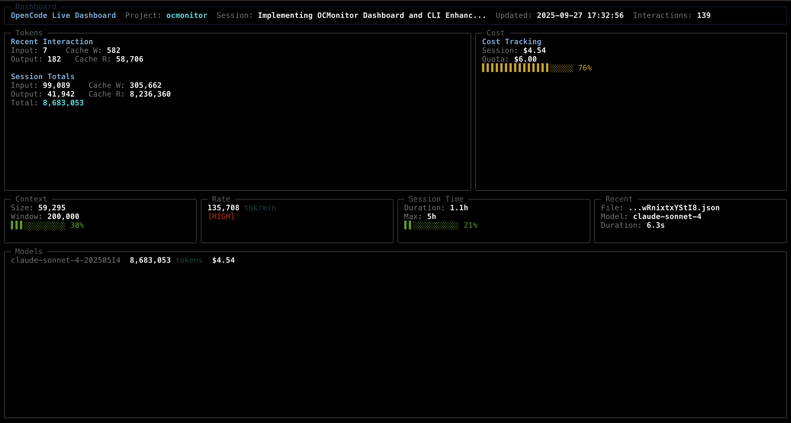

# 📊 OpenCode Monitor

[](https://www.python.org/downloads/)
[](https://opensource.org/licenses/MIT)

**OpenCode Monitor is a CLI tool for monitoring and analyzing OpenCode AI coding sessions.**

Transform your OpenCode usage data into beautiful, actionable insights with comprehensive analytics, real-time monitoring, and professional reporting capabilities.

[](screenshots/sessions-summary.png)

## 🌟 Features

### 💼 Professional Analytics
- **📈 Comprehensive Reports** - Daily, weekly, and monthly usage breakdowns
- **💰 Cost Tracking** - Accurate cost calculations for multiple AI models
- **📊 Model Analytics** - Detailed breakdown of usage per AI model
- **⏱️ Performance Metrics** - Session duration and processing time tracking

### 🎨 Beautiful User Interface
- **🌈 Rich Terminal UI** - Colorful tables and panels with perfect alignment
- **📊 Progress Bars** - Visual indicators for cost quotas and context usage
- **🚥 Color Coding** - Green/yellow/red status indicators based on usage thresholds
- **📱 Live Dashboard** - Real-time monitoring of your current coding session

### 📤 Data Export & Integration
- **📋 CSV Export** - Spreadsheet-compatible exports with metadata
- **🔄 JSON Export** - Machine-readable exports for custom integrations
- **📊 Multiple Report Types** - Sessions, daily, weekly, monthly, and model reports

## 🚀 Quick Start

### Installation

**Option 1: Automated Installation (Recommended)**
```bash
git clone https://github.com/yourusername/ocmonitor.git
cd ocmonitor
./install.sh
```

**Option 2: Manual Installation**
```bash
git clone https://github.com/yourusername/ocmonitor.git
cd ocmonitor
python3 -m pip install -r requirements.txt
python3 -m pip install -e .
```

### Basic Usage

```bash
# Quick configuration check
ocmonitor config show

# Analyze your sessions
ocmonitor sessions ~/.local/share/opencode/storage/message

# Real-time monitoring
ocmonitor live ~/.local/share/opencode/storage/message

# Export your data
ocmonitor export sessions ~/.local/share/opencode/storage/message --format csv
```

## 📖 Documentation

- **[Quick Start Guide](QUICK_START.md)** - Get up and running in 5 minutes
- **[Manual Test Guide](MANUAL_TEST_GUIDE.md)** - Comprehensive testing instructions
- **[Contributing Guidelines](CONTRIBUTING.md)** - How to contribute to the project

## 🎯 Use Cases

### Individual Developers
- **Cost Management** - Track your AI usage costs across different models
- **Usage Optimization** - Identify patterns in your coding sessions
- **Performance Monitoring** - Monitor session efficiency and token usage

### Development Teams
- **Team Analytics** - Aggregate usage statistics across team members
- **Budget Planning** - Forecast AI costs based on usage trends
- **Model Comparison** - Compare performance and costs across different AI models

### Organizations
- **Resource Planning** - Plan AI resource allocation and budgets
- **Usage Reporting** - Generate professional reports for stakeholders
- **Cost Attribution** - Track AI costs by project or team


## 📊 Example Output

> **📸 Screenshots**: The following examples include both text output and clickable screenshots. To add your own screenshots, place PNG files in the `screenshots/` directory with the corresponding filenames.

### Sessions Summary

[](screenshots/sessions-summary.png)

*Click image to view full-size screenshot of sessions summary output*


### Live Monitoring Commands

#### `ocmonitor live <path>`

Real-time monitoring dashboard that updates automatically.

```bash
# Start live monitoring (updates every 5 seconds)
ocmonitor live ~/.local/share/opencode/storage/message

# Custom refresh interval (in seconds)
ocmonitor live ~/.local/share/opencode/storage/message --refresh 10
```

**Features:**
- 🔄 Auto-refreshing display
- 📊 Real-time cost tracking
- ⏱️ Live session duration
- 📈 Token usage updates
- 🚦 Color-coded status indicators

[](screenshots/live_dashboard.png)

*Click image to view full-size screenshot of the live monitoring dashboard*

### Model Usage Breakdown

[](screenshots/model-usage-breakdown.png)

*Click image to view full-size screenshot of model usage analytics*


## ⚙️ Configuration

The tool is highly configurable through `config.toml`:

```toml
[paths]
messages_dir = "~/.local/share/opencode/storage/message"
export_dir = "./exports"

[ui]
table_style = "rich"
progress_bars = true
colors = true

[export]
default_format = "csv"
include_metadata = true
```

## 🛠️ Development

### Prerequisites
- Python 3.7+
- pip package manager

### Setting Up Development Environment
```bash
git clone https://github.com/yourusername/ocmonitor.git
cd ocmonitor
python3 -m pip install -r requirements.txt
python3 -m pip install -e .
```

### Running Tests
```bash
# Basic functionality test
python3 test_basic.py

# Simple import tests  
python3 test_simple.py
```

### Project Architecture
```
ocmonitor/
├── ocmonitor/              # Core package
│   ├── cli.py             # Command-line interface
│   ├── config.py          # Configuration management
│   ├── models/            # Pydantic data models
│   ├── services/          # Business logic services
│   ├── ui/                # Rich UI components
│   └── utils/             # Utility functions
├── config.toml            # User configuration
├── models.json            # AI model pricing data
└── test_sessions/         # Sample test data
```

## 🤝 Contributing

We welcome contributions! Please see our [Contributing Guidelines](CONTRIBUTING.md) for details on:

- 🐛 Reporting bugs
- 💡 Suggesting features
- 🔧 Setting up development environment
- 📝 Code style and standards
- 🚀 Submitting pull requests

## 📄 License

This project is licensed under the MIT License - see the [LICENSE](LICENSE) file for details.

## 🏆 Acknowledgments

- **[OpenCode](https://opencode.ai/)** - For creating an excellent AI coding agent that makes development more efficient
- **[ccusage](https://ccusage.com/)** - A similar monitoring tool for Claude Code that inspired features in this project
- **[Click](https://click.palletsprojects.com/)** - Excellent CLI framework
- **[Rich](https://github.com/Textualize/rich)** - Beautiful terminal formatting
- **[Pydantic](https://pydantic-docs.helpmanual.io/)** - Data validation and settings

## 🚀 Status

**🧪 Beta Testing** - This application is currently in beta testing phase. Please report any issues you encounter.

**⚠️ Disclaimer** - This application is not affiliated with OpenCode AI. It is an independent community tool for monitoring OpenCode usage.

---

*Built with ❤️ for the OpenCode community*